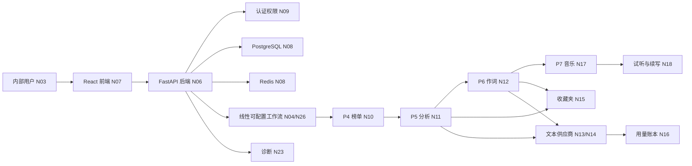

# 蓝乐项目压缩记忆图谱

最后更新：2026-07-19

用途：这是蓝乐项目跨会话、上下文压缩和多 Agent 接手时的**第一读取入口**。它只保存当前有效事实和关系；详细需求、历史理由、代码细节与故障证据继续保存在所链接的正式文档、Git 和日志中。

## 0. 恢复协议

接手蓝乐任务时按顺序执行：

1. 读 `D:\SunJX\AGENTS.md`。
2. 读本文件，只加载当前任务涉及的节点。
3. 按节点中的“事实来源”读取对应正式文档，不重复读取所有聊天历史。
4. 执行 `git status`、`git pull`，不得覆盖其他改动。
5. 需要运行系统时检查 `8000`、`5173`、PostgreSQL 和 Redis。
6. 完成功能后测试、更新受影响节点、commit、push。

## 1. 当前状态向量

```text
产品：单客户内部团队使用的 AI 音乐创作工作台
主线：线性可配置工作流，内部按独立 Agent 模块实现并逐步传参
阶段：P0-P6.5 已完成；P7 音乐生成待官方 API 审核/选型与开发；P8 联调交付待开始
文本 AI：智谱 glm-4.7-flash，仅用于开发联调，可热切换
运行：Docker 跑 PostgreSQL/Redis，本地进程跑 FastAPI/Vite
测试基线：后端 54；前端 13（以当前实际 pytest/vitest 输出为准）
首要下一步：等待 Suno 官方 Developer API 回复，同时保留正式 API 备选，确定供应商后进入 P7
```

## 2. 事实节点

| ID | 实体 | 当前有效事实 | 事实来源 |
|---|---|---|---|
| `N01` | 仓库 | 根目录 `D:\SunJX`；项目 `projects\blue-music-platform`；主分支 `main` | `AGENTS.md` |
| `N02` | 产品 | 蓝乐不是自研模型，而是把榜单、分析、作词、音乐生成和结果管理串成工作台 | 项目 `README.md` |
| `N03` | 客户 | 少量内部成员使用；无公开注册；数据默认团队共享；超级管理员创建账号并分配权限 | `docs/02-decisions/决策记录.md` |
| `N04` | 首期工作流 | 用户从采集、分析、作词中选择线性步骤并保存模板；运行时真实传递 snapshot/entry/report/version 编号；P7 后接音乐生成 | `P6.5_线性自动工作流维护说明.md` |
| `N05` | 范围 | 已支持既有步骤的线性组合；不做拖拽 DAG、分支并行、手工参数映射、总调度 AI、多作词 Agent和复杂长期记忆 | `需求规格说明书_v2.md`、决策记录 |
| `N06` | 后端 | FastAPI；入口 `backend/app/main.py`；分层为 routes/schemas/services/models/core/adapters | `中文代码地图.md` |
| `N07` | 前端 | React + TypeScript + Ant Design；入口 `frontend/src/main.tsx`；开发地址 `127.0.0.1:5173` | 项目 `README.md` |
| `N08` | 数据设施 | PostgreSQL 保存业务数据；Redis 为缓存和未来异步队列预留；Docker Compose 管理二者 | `docker-compose.yml` |
| `N09` | 认证权限 | Argon2 密码哈希、JWT、超级管理员、成员和四类 Agent 权限已完成 | P2 文档与代码 |
| `N10` | P4 榜单 | 酷狗 TOP500、每日一份快照、同日覆盖并更新最后采集时间、30 天保留、运行记录单删/批删、详情折叠展示 | 决策记录、P4-P6 维护说明 |
| `N11` | P5 分析 | 连续榜单趋势、结构化创作方向、任务单删/批删；只依据元数据，不伪装音频分析；速度统一为 slow/medium/fast | P4-P6 维护说明 |
| `N12` | P6 作词 | 生成、重新生成、版本保存、标准段落、统一音乐创作方案、任务单删和批量删除已完成 | P4-P6 维护说明 |
| `N13` | 文本供应商 | 模板 + 数据库配置 + 环境变量后备；API Key 加密；连接测试后启用；运行时免重启热切换 | 决策记录 |
| `N14` | 当前文本模型 | 本机启用智谱 `glm-4.7-flash`；最长等待 180 秒；读取超时不复制请求；无 Retry-After 的 429 不自动重试 | 错误手册 |
| `N15` | 收藏夹 | 团队共享；收藏具体分析报告或歌词版本；支持分类、时间、创建人和隐藏备注；主动删除作词任务会同步移除其歌词收藏 | 决策记录 |
| `N16` | 用量看板 | `api_usage_records` 统一记录接口、模型、Token、耗时、尝试次数和供应商请求编号 | 决策记录 |
| `N17` | P7 音乐 | 尚未实现；2026-07-19 已提交 Suno 官方 Developer API 申请，当前仅为待审核、未获文档/权限/密钥/商用授权；Mureka、MiniMax 等正式 API 继续作为备选；不得接非官方 Suno 套壳或网页自动化 | 决策记录 |
| `N18` | 音乐结果 UX | 生成结果进入独立试听区；试听不额外生成；每首独立播放/下载；支持“首段 -> 试听 -> 主动续写” | 决策记录 |
| `N19` | 执行模型 | 手工分析和作词仍同步；自动流程用 FastAPI 后台任务立即返回并由前端 2.5 秒轮询；进程重启会中断，Redis Worker 属于后续工程化 | 错误手册、P6.5 维护说明 |
| `N20` | 数据保留 | 普通产物计划保留 30 天；自动清理跳过收藏；主动删除按采集/分析/作词边界清关联数据，但保留每日榜单和接口用量审计 | 决策记录 |
| `N21` | UI 规则 | 长列表默认只预览最新记录并可展开；接口调用按任务类型分组；不把全部历史常驻铺开 | 决策记录 |
| `N22` | 交付偏好 | 合同项目交付优先，预算有限，功能完整和可维护优先于高级架构；主动开发，不再以逐课教学阻塞主线 | 用户最新口径 |
| `N23` | 维护目标 | 错误必须带稳定错误码、task_id/request_id、供应商状态和安全诊断，便于 Codex 代维护 | 错误手册 |
| `N24` | 安全 | 不记录明文密码/API Key；外部失败必须真实失败；不得用假成功通过验收 | `AGENTS.md`、错误手册 |
| `N25` | 电脑模式 | 开发模式开启虚拟化供 Docker 使用；游戏模式关闭虚拟化；切换后通常需重启 | 工作区初始化笔记 |
| `N26` | P6.5 调度 | `workflow_templates/runs/run_steps` 持久化；全局单流程；分析到作词默认冷却 15 秒；步骤保存 task_id/output_id，失败即停；运行历史可单删/批删且不删除模板或步骤产出 | P6.5 维护说明、决策记录 |

## 3. 关系边



关键约束边：

```text
P7 依赖 P5/P6 的统一创作方案
外部供应商必须经过 adapter，不得写死进业务 service
所有团队成员共享业务数据，但任务仍记录创建人
收藏关系指向具体产物版本，不指向会变化的任务外壳
运行中切换 AI 配置只影响后续任务
自动流程的数据边：snapshot_id -> entry_ids -> report_id -> lyrics_version_id
音乐步骤在 P7 正式供应商接入前禁用
```

## 4. 运行图

```text
浏览器 :5173
  -> /api/v1
FastAPI :8000
  -> PostgreSQL :5432
  -> Redis :6379（未来队列）
  -> 酷狗公开页面
  -> 活动文本 AI 配置
  -> P7 正式音乐 API（待实现）
```

常用命令：

```powershell
cd D:\SunJX\projects\blue-music-platform
docker compose up -d postgres redis
docker compose ps

cd backend
D:\DevTools\Venvs\blue-music-backend\Scripts\python.exe -m uvicorn app.main:app --host 127.0.0.1 --port 8000
D:\DevTools\Venvs\blue-music-backend\Scripts\python.exe -m pytest

cd ..\frontend
npm.cmd run dev -- --host 127.0.0.1 --port 5173
npm.cmd test
npm.cmd run lint
npm.cmd run build
```

健康地址：

```text
http://127.0.0.1:8000/api/v1/health
http://127.0.0.1:8000/api/v1/health/database
```

## 5. 故障知识节点

| 现象 | 已知判断 | 当前处理 |
|---|---|---|
| “无法连接后端” | 请求未到 FastAPI，或恰逢重启 | 先查 8000 和两个健康接口，再查进程与 CORS |
| 智谱 `429/1302` | 账户在途并发或速率限制 | 单次等 180 秒；读取超时不重复；无 Retry-After 不自动重试 |
| 任务永久“运行中” | 进程在外部调用期间重启 | 按理论最长运行时间自动写入 `*_TASK_INTERRUPTED` |
| 歌词段落缺 `content` | 模型结构不完整 | 严格段落 Schema，记录 `LYRICS_PROVIDER_FAILED` |
| 分析速度为 `medium-fast` | AI 别名超出 API 枚举 | 统一归一为 `fast`，旧报告读取时兼容 |
| Docker 不运行 | 可能处于游戏模式或虚拟化关闭 | 切开发模式并重启，再检查 Docker Desktop |

日志：

```text
D:\SunJX\projects\blue-music-platform\backend\logs\app.log
D:\SunJX\projects\blue-music-platform\backend\logs\uvicorn.stderr.log
```

## 6. 不得遗忘

- 不保存或输出真实密码、Token、API Key。
- 不回滚其他 Agent 或用户的改动。
- 不把免费开发模型直接承诺为生产方案。
- 不把元数据推断描述成真实音频检测。
- 不为“看起来成功”而吞掉外部错误。
- 不在 P7 选型前写死音乐供应商。
- 不为有限预算提前实现拖拽 DAG、分支并行、总调度 AI、复杂记忆或多 Agent 市场。

## 7. 详细事实入口

```text
项目入口：projects\blue-music-platform\README.md
当前需求：projects\blue-music-platform\docs\01-current-scope\需求规格说明书_v2.md
产品决策：projects\blue-music-platform\docs\02-decisions\决策记录.md
阶段状态：projects\blue-music-platform\docs\03-implementation\分阶段开发任务书.md
代码关系：projects\blue-music-platform\项目知识图谱.md
错误定位：projects\blue-music-platform\docs\03-implementation\错误定位与错误码手册.md
P4-P6 运维：projects\blue-music-platform\docs\03-implementation\P4-P6_榜单分析作词维护说明.md
P6.5 工作流：projects\blue-music-platform\docs\03-implementation\P6.5_线性自动工作流维护说明.md
Git 历史：git log --oneline
```

## 8. 图谱维护规则

1. 本文件只保留**当前有效事实**，不追加流水账。
2. 新决策先写正式决策记录，再更新对应节点和关系边。
3. 详细实现写阶段文档；本文件只保留状态、入口和约束。
4. 故障解决后只留下可复用判断，不粘贴长堆栈。
5. 密钥和账号凭据永远不进入图谱。
6. 每次阶段切换、供应商切换、运行方式变化或测试基线显著变化时更新。
