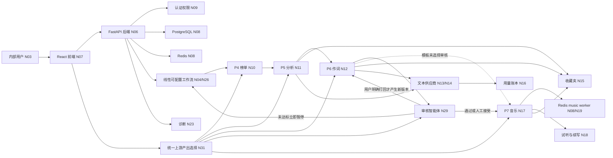

# 蓝乐项目压缩记忆图谱

最后更新：2026-08-16

用途：这是蓝乐项目跨会话、上下文压缩和多 Agent 接手时的**第一读取入口**。它只保存当前有效事实和关系；详细需求、历史理由、代码细节与故障证据继续保存在所链接的正式文档、Git 和日志中。

## 0. 恢复协议

接手蓝乐任务时按顺序执行：

1. 读 `D:\SunJX\AGENTS.md`。
2. 读本文件，只加载当前任务涉及的节点。
3. 按节点中的“事实来源”读取对应正式文档，不重复读取所有聊天历史。
4. 执行 `git status`、`git pull`，不得覆盖其他改动。
5. 需要运行系统时检查 `8000`、`5173`、PostgreSQL 和 Redis。
6. 完成功能后测试、更新受影响节点、commit、push。

## 1. 当前状态向量

```text
产品：单客户内部团队使用的 AI 音乐创作工作台
主线：线性可配置工作流，内部按独立 Agent 模块实现并逐步传参
阶段：P0-P6.5 已完成；P7 统一 SunoProvider、队列、重试、额度和对象存储已完成，官方 API 契约待联调；P8 审核智能体及自动审核闭环已完成；P8.1 上游产出选择体验已统一
文本 AI：Kimi 官方 kimi-k3，付费开发稳定性测试，可热切换；智谱/本地规则保留后备
运行：Docker 跑 PostgreSQL/Redis，本地进程跑 FastAPI/Vite
测试基线：后端 86；前端 26（以当前实际 pytest/vitest 输出为准）
首要下一步：本机 GitHub 兼容实现的隔离服务、登录会话和真实额度查询已联通；等待用户确认后做一次真实生成与结果下载验收，同时继续等待 Suno Platform 正式文档、API Key 和商用权限
上线阻断：客户部署前创建并验收独立生产文本密钥，随后在 Kimi 控制台吊销当前开发测试密钥；不得把测试密钥带入生产
```

## 2. 事实节点

| ID | 实体 | 当前有效事实 | 事实来源 |
|---|---|---|---|
| `N01` | 仓库 | 根目录 `D:\SunJX`；项目 `projects\blue-music-platform`；主分支 `main` | `AGENTS.md` |
| `N02` | 产品 | 蓝乐不是自研模型，而是把榜单、分析、作词、音乐生成和结果管理串成工作台 | 项目 `README.md` |
| `N03` | 客户 | 少量内部成员使用；无公开注册；数据默认团队共享；超级管理员创建账号并分配权限 | `docs/02-decisions/决策记录.md` |
| `N04` | 首期工作流 | 用户从采集、分析、作词、审核、音乐创作中选择线性步骤并保存模板；运行时真实传递 snapshot/entry/report/lyrics version/review/music result 编号 | `P6.5_线性自动工作流维护说明.md`、`P7_Suno音乐创作维护说明.md` |
| `N05` | 范围 | 已支持既有步骤的线性组合和单次审核人工闸门；不做拖拽 DAG、分支并行、手工参数映射、总调度 AI、多作词 Agent 或无人值守循环 | `需求规格说明书_v2.md`、决策记录 |
| `N06` | 后端 | FastAPI；入口 `backend/app/main.py`；分层为 routes/schemas/services/models/core/adapters | `中文代码地图.md` |
| `N07` | 前端 | React + TypeScript + Ant Design；入口 `frontend/src/main.tsx`；开发地址 `127.0.0.1:5173` | 项目 `README.md` |
| `N08` | 数据设施 | PostgreSQL 保存业务数据；Redis 已承担音乐任务、处理中任务、延迟重试、并发槽和限频；Docker Compose 管理数据库、Redis、后端和 music worker | `docker-compose.yml`、P7 维护说明 |
| `N09` | 认证权限 | Argon2 密码哈希、JWT、超级管理员、成员和四类 Agent 权限已完成 | P2 文档与代码 |
| `N10` | P4 榜单 | 酷狗 TOP500 与飙升榜独立快照；同日同榜覆盖并更新最后采集时间，快照按最后采集时间倒序；TOP500 用于多日趋势，飙升榜代表当前上升最快列表且不计算多日窗口；手工可单曲分析，自动流程可指定目标名次（默认 1）并只分析该首；30 天保留、运行记录单删/批删、详情折叠展示 | 决策记录、P4-P6 维护说明 |
| `N11` | P5 分析 | 手工分析先从保留期快照选择器明确选择 `snapshot_id`，可回选任意 TOP500/飙升榜结果，再勾选歌曲；未勾选时分析所选快照前 30 首，不得退回全局最新；结构化创作方向按推荐优先级排序，首项为首选，自动流程在分析完成后固定传首项且不让用户预选未知编号，手工作词仍可查看后选择；任务支持单删/批删；只依据元数据，不伪装音频分析；速度统一为 slow/medium/fast | P4-P6 维护说明、决策记录 |
| `N12` | P6 作词 | 生成、重新生成、版本保存、标准段落、统一音乐创作方案、任务单删和批量删除已完成；引用分析在页内按待分类/S/A/B/C/D 选择，显示分析任务号并用报告号提交，选中后自动填充完整创作参数；歌词页和审核记录内的 AI 助手都只生成预览，用户确认后创建新版本并设为当前作品，旧版本保留 | P4-P6 维护说明、P8 维护说明 |
| `N13` | 文本供应商 | 模板 + 数据库配置 + 环境变量后备；API Key 加密；连接测试后启用；运行时免重启热切换 | 决策记录 |
| `N14` | 当前文本模型 | 本机活动配置为 Kimi 官方 `kimi-k3` 付费测试；`max_completion_tokens`、JSON Mode、固定采样参数、`reasoning_effort=low`；最长等待 180 秒；智谱与本地规则保留后备 | P4-P6 维护说明、决策记录 |
| `N15` | 收藏夹 | 团队共享；收藏具体分析报告、歌词版本或音乐结果；按待分类/S/A/B/C/D 分级并可隐藏备注，等级与产物类型独立；主动删除作词任务会同步移除其歌词收藏 | 决策记录、P8 维护说明 |
| `N16` | 用量看板 | `api_usage_records` 统一记录接口、模型、Token、耗时、尝试次数和供应商请求编号 | 决策记录 |
| `N17` | P7 音乐 | 业务层统一使用 `suno` Provider；`official` 保留为生产优先实现并等待 Platform 账号内文档；本机演示环境已选择 `compatibility`，隔离服务位于 `127.0.0.1:3000`；管理员维护默认 `v4.5` 模型，新任务记录模型与目标/避免风格；授权改编要求权利确认；不集成 2Captcha、指纹规避或验证码绕过 | P7、P8 维护说明 |
| `N18` | 音乐结果 UX | 生成结果进入独立试听区；试听不额外生成；每首独立播放/下载；支持“首段 -> 试听 -> 主动续写” | 决策记录 |
| `N19` | 执行模型 | 手工分析和作词仍同步；自动流程由 FastAPI 后台任务推进，审核每次只调用一次，未达标立即暂停且不自动修改；音乐任务由 Redis 独立 worker 执行，外部编号收到即落库，支持进程重启续查、全局并发/限频、延迟重试和人工验证后重新入队 | P6.5/P7 维护说明 |
| `N20` | 数据保留 | 普通产物计划保留 30 天；自动清理跳过收藏；主动删除按采集/分析/作词边界清关联数据，但保留每日榜单和接口用量审计 | 决策记录 |
| `N21` | UI 规则 | 内部操作台导航按总览/创作流程/资产与协作/系统管理分组；核心表单使用固定操作栏；长列表默认只预览最新记录并可展开，接口调用按任务类型分组；手工引用上一步产出统一用紧凑摘要 + 可搜索/分组/详情预览的 Drawer，预览与确认分离；桌面 1200px 与手机 390px 不允许页面级横向溢出 | 决策记录、P8/P8.1 维护说明 |
| `N22` | 交付偏好 | 合同项目交付优先，预算有限，功能完整和可维护优先于高级架构；主动开发，不再以逐课教学阻塞主线 | 用户最新口径 |
| `N23` | 维护目标 | 错误必须带稳定错误码、task_id/request_id、供应商状态和安全诊断，便于 Codex 代维护 | 错误手册 |
| `N24` | 安全 | 不记录明文密码/API Key；外部失败必须真实失败；不得用假成功通过验收 | `AGENTS.md`、错误手册 |
| `N25` | 电脑模式 | 开发模式开启虚拟化供 Docker 使用；游戏模式关闭虚拟化；切换后通常需重启 | 工作区初始化笔记 |
| `N26` | P6.5 调度 | `workflow_templates/runs/run_steps` 持久化；支持采集、分析、作词、审核、音乐创作五步；全局单流程；步骤保存 task_id/output_id/result_detail；普通失败即停，审核低于所选智能体及格线立即 paused，下游保持等待；只有用户明确打回/重审/重新生成才触发下一次调用；运行历史可单删/批删且不删除模板或步骤产出 | P6.5/P7/P8 维护说明、决策记录 |
| `N27` | 音乐额度 | Suno 真实余额只向超级管理员展示；员工按音乐任务次数分配，新生成/续写各扣 1 次，重试不重复扣；默认 0，管理员可设置剩余次数；失败和删除不自动返还 | P7 维护说明、决策记录 |
| `N28` | Kimi 测试密钥 | 当前 Kimi 密钥仅用于开发调试并以数据库密文保存；客户部署前必须切换独立生产密钥并吊销当前测试密钥，配置名已标记“上线前更换” | P4-P6 维护说明、决策记录 |
| `N29` | 审核智能体 | 独立审核页；管理员经初始化对话创建人设、规则和长期记忆并分配成员，成员权限使用直接可见的响应式复选网格，支持多选/取消后统一保存；成员只见记忆概述，完整记忆仅管理员展开；最近审核的详细报告独立展开/隐藏，顶部 AI 修改区始终可见并自动带入该次审核意见，`lyrics_assistant_messages.review_run_id` 隔离每份报告的对话，预览经用户确认后成为当前歌词版本且旧版保留；审核作用域接口校验成员权限、审核归属和预览版本；记忆显式保存并由 AI 去重；每个智能体有独立及格线（默认 80、管理员可调）；自动流程每次只审一次，未通过返回扣分原因和修改建议并立即暂停，支持接受、明确打回、手工修改后重审或重新生成 | P6.5/P8 维护说明、决策记录 |
| `N30` | AI 接手记忆 | 本文件是唯一压缩入口，只放当前事实、关系、运行与故障节点；阶段文档保存实现细节，Git 保存历史。功能、数据模型、供应商、运行方式或测试基线变化时必须同步更新，禁止靠聊天历史维持项目状态 | `AGENTS.md`、本文件维护规则 |
| `N31` | 上游产出选择 | `UpstreamOutputPicker` 统一榜单快照到分析、分析方向到作词、歌词版本到审核和歌词版本到音乐四条手工数据边；页面只做领域映射和确认写回，点击候选只预览；歌词共用映射位于 `lib/upstreamOutputs.ts`；自动流程不经过该组件 | P8.1 维护说明、项目知识图谱 |

## 3. 关系边


```mermaid
flowchart LR
    User["内部用户 N03"] --> UI["React 前端 N07"]
    UI --> API["FastAPI 后端 N06"]
    API --> Auth["认证权限 N09"]
    API --> DB["PostgreSQL N08"]
    API --> Redis["Redis N08"]
    API --> Flow["线性可配置工作流 N04/N26"]
    Flow --> Rank["P4 榜单 N10"]
    Rank --> Analysis["P5 分析 N11"]
    Analysis --> Lyrics["P6 作词 N12"]
    Lyrics --> Review["审核智能体 N29"]
    Review -->|未达标立即暂停| Flow
    Review -->|用户明确打回才产生新版本| Lyrics
    Review -->|通过或人工接受| Music["P7 音乐 N17"]
    Lyrics -.->|模板未选择审核| Music
    Music --> RedisWorker["Redis music worker N08/N19"]
    Music --> Audition["试听与续写 N18"]
    UI --> Picker["统一上游产出选择 N31"]
    Picker --> Rank
    Picker --> Analysis
    Picker --> Lyrics
    Picker --> Review
    Picker --> Music
    Analysis --> Favorite["收藏夹 N15"]
    Lyrics --> Favorite
    Music --> Favorite
    Analysis --> Provider["文本供应商 N13/N14"]
    Lyrics --> Provider
    Provider --> Usage["用量账本 N16"]
    API --> Diagnostics["诊断 N23"]
```

关键约束边：

```text
P7 依赖 P5/P6 的统一创作方案
外部供应商必须经过 adapter，不得写死进业务 service
所有团队成员共享业务数据，但任务仍记录创建人
收藏关系指向具体产物版本，不指向会变化的任务外壳
运行中切换 AI 配置只影响后续任务
自动流程的数据边：snapshot_id -> entry_ids -> report_id -> lyrics_version_id
手工分析的数据边：用户选择 snapshot_id -> 可选 entry_ids；空 entry_ids 仍只取所选快照前 30 首
自动审核的数据边：lyrics_version_id -> 单次 review_run -> 通过/paused；不得无人值守循环
独立审核修改边：review_run -> review_guidance -> assistant preview -> 用户确认 -> 当前 LyricsVersion；旧版本保留
paused 审核决定：接受当前版本，或明确打回/读取手工最新版本/重新生成后只复审一次
歌词 AI 助手的数据边：lyrics_version_id -> assistant preview -> 用户确认 -> 新 lyrics_version_id
手工上游选择边：候选列表 -> 详情预览（不写表单）-> 用户明确确认 -> 稳定数据库编号写回
审核智能体的长期记忆只由显式保存操作写入；成员不能读取完整记忆
官方/兼容实现切换只影响新任务；已有任务保持创建时的实现
兼容服务 Cookie 不进入蓝乐；hCaptcha 触发后失败暂停并等待人工验证
```

## 4. 运行图

```text
浏览器 :5173
  -> /api/v1
FastAPI :8000
  -> PostgreSQL :5432
  -> Redis :6379（音乐队列、重试、并发和限频）
  -> music worker
  -> 酷狗公开页面
  -> 活动文本 AI 配置
  -> P7 正式音乐 API（待实现）
```

常用命令：

```powershell
cd D:\SunJX\projects\blue-music-platform
docker compose up -d postgres redis
docker compose ps

cd backend
D:\DevTools\Venvs\blue-music-backend\Scripts\python.exe -m uvicorn app.main:app --host 127.0.0.1 --port 8000
D:\DevTools\Venvs\blue-music-backend\Scripts\python.exe -m app.workers.music
D:\DevTools\Venvs\blue-music-backend\Scripts\python.exe -m pytest

cd ..\frontend
npm.cmd run dev -- --host 127.0.0.1 --port 5173
npm.cmd test
npm.cmd run lint
npm.cmd run build
```

健康地址：

```text
http://127.0.0.1:8000/api/v1/health
http://127.0.0.1:8000/api/v1/health/database
```

## 5. 故障知识节点

| 现象 | 已知判断 | 当前处理 |
|---|---|---|
| “无法连接后端” | 请求未到 FastAPI，或恰逢重启 | 先查 8000 和两个健康接口，再查进程与 CORS |
| 智谱 `429/1302` | 账户在途并发或速率限制 | 单次等 180 秒；读取超时不重复；无 Retry-After 不自动重试 |
| Kimi 余额显示错误 | 官方余额接口、密钥或网络暂时不可用 | 不影响任务执行；检查活动配置和 Kimi 控制台后刷新 Dashboard |
| 音乐任务永久“运行中” | worker 在外部调用期间中断 | 超时后恢复为 pending 并重新入队；已有外部任务编号时继续查询 |
| 自动流程停在 `paused` | 单次歌词审核低于所选智能体及格线，属于等待人工决定，不是崩溃 | 查看扣分原因和建议，再选择接受、打回 AI、手工修改后重审或重新生成；系统不会自行继续 |
| `SUNO_HUMAN_VERIFICATION_REQUIRED` | Suno 主动要求 hCaptcha | 管理员在正常网页验证、更新隔离会话，再点“重新入队” |
| `SUNO_COOKIE_NOT_CONFIGURED` | GitHub 兼容服务已启动但尚未配置登录会话 | 在本机运行隐藏输入脚本，重启兼容服务，再刷新状态和额度 |
| 歌词段落缺 `content` | 模型结构不完整 | 严格段落 Schema，记录 `LYRICS_PROVIDER_FAILED` |
| 分析速度为 `medium-fast` | AI 别名超出 API 枚举 | 统一归一为 `fast`，旧报告读取时兼容 |
| Docker 不运行 | 可能处于游戏模式或虚拟化关闭 | 切开发模式并重启，再检查 Docker Desktop |

日志：

```text
D:\SunJX\projects\blue-music-platform\backend\logs\app.log
D:\SunJX\projects\blue-music-platform\backend\logs\uvicorn.stderr.log
```

## 6. 不得遗忘

- 不保存或输出真实密码、Token、API Key。
- 不回滚其他 Agent 或用户的改动。
- 不把免费开发模型直接承诺为生产方案。
- 不把元数据推断描述成真实音频检测。
- 不为“看起来成功”而吞掉外部错误。
- 不让工作流或其他 Agent 直接调用 Suno 底层实现。
- 不接入 2Captcha 自动代答、浏览器指纹规避或验证码绕过。
- 不为有限预算提前实现拖拽 DAG、分支并行、总调度 AI、任意循环、复杂记忆或多 Agent 市场；审核步骤必须保持单次调用和人工确认边界。
- 客户部署前必须吊销当前 Kimi 开发测试密钥，并使用独立生产密钥重新验收。

## 7. 详细事实入口

```text
项目入口：projects\blue-music-platform\README.md
当前需求：projects\blue-music-platform\docs\01-current-scope\需求规格说明书_v2.md
产品决策：projects\blue-music-platform\docs\02-decisions\决策记录.md
阶段状态：projects\blue-music-platform\docs\03-implementation\分阶段开发任务书.md
代码关系：projects\blue-music-platform\项目知识图谱.md
错误定位：projects\blue-music-platform\docs\03-implementation\错误定位与错误码手册.md
P4-P6 运维：projects\blue-music-platform\docs\03-implementation\P4-P6_榜单分析作词维护说明.md
P6.5 工作流：projects\blue-music-platform\docs\03-implementation\P6.5_线性自动工作流维护说明.md
P7 音乐：projects\blue-music-platform\docs\03-implementation\P7_Suno音乐创作维护说明.md
P8 协作：projects\blue-music-platform\docs\03-implementation\P8_创作协作与审核体验维护说明.md
P8.1 选择器：projects\blue-music-platform\docs\03-implementation\P8.1_上游产出选择器维护说明.md
Git 历史：git log --oneline
```

## 8. 图谱维护规则

1. 本文件只保留**当前有效事实**，不追加流水账。
2. 新决策先写正式决策记录，再更新对应节点和关系边。
3. 详细实现写阶段文档；本文件只保留状态、入口和约束。
4. 故障解决后只留下可复用判断，不粘贴长堆栈。
5. 密钥和账号凭据永远不进入图谱。
6. 每次阶段切换、供应商切换、运行方式变化或测试基线显著变化时更新。
