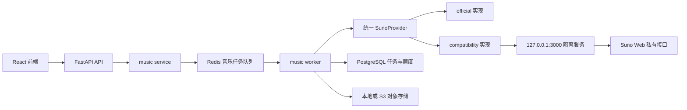

# P7 Suno 兼容服务外部 AI 交接说明

最后核对：2026-08-11

## 1. 交接目的

本文用于把蓝乐项目的 Suno 兼容实现交给另一个 AI 继续处理。交接重点是
仓库位置、固定版本、调用边界、当前状态、代码入口和回归要求，不包含任何
Cookie、内部令牌、API Key 或验证码自动化实现说明。

当前用户希望外部 AI 对照上游项目，补齐其认为缺少的路由、参数、依赖和
功能，并自行处理上游验证码相关实现。当前 Codex 没有写入或启用验证码
自动代答、浏览器指纹伪装或反检测实现；接手方需要独立判断相关平台条款、
安全要求和实现边界，不能把本文视为对该部分的授权或技术说明。

## 2. Git 仓库与固定版本

### 蓝乐主仓库

- Git 地址：`git@github.com:sunjiaxing520/SunJX.git`
- Web 地址：`https://github.com/sunjiaxing520/SunJX`
- 本地根目录：`D:\SunJX`
- 蓝乐项目目录：`D:\SunJX\projects\blue-music-platform`
- 分支：`main`
- 交接时提交：`18e0ed934261397f2b3ba9a05fd8e4a15421b232`

主仓库可能是私有仓库。接手方必须使用用户已有的 GitHub 权限，不得请求、
输出或记录访问令牌。

### 上游 Suno 兼容项目

- 项目：`gcui-art/suno-api`
- Git 地址：`https://github.com/gcui-art/suno-api.git`
- 项目页面：`https://github.com/gcui-art/suno-api`
- 许可证：`LGPL-3.0-or-later`
- 蓝乐当前固定的上游提交：
  `a2e6a823428903af715d3835d1cb44ffa336021d`
- 本地隔离运行目录：`D:\DevTools\SunoCompat`
- 本地适配分支：`blue-music-safe`
- 当前本地适配提交：
  `99cec077f340d171e3278cb386a246b2c4d0ed57`

`D:\DevTools\SunoCompat` 是完整上游克隆，不是手工摘录的几个文件。蓝乐的
改动以独立提交和补丁形式维护，便于辨认上游源码与项目适配代码。

## 3. 当前架构



关键边界：

1. 工作流和其他 Agent 只能调用蓝乐统一音乐服务，不能直接调用
   `gcui-art/suno-api`。
2. `official` 和 `compatibility` 必须保持可切换；切换只影响新任务。
3. Suno Cookie 只存在于隔离服务本机环境，不进入蓝乐数据库、请求、日志或
   Git。
4. 蓝乐与隔离服务通过独立 Bearer Token 通信；默认只允许回环地址。
5. 生成任务必须继续经过 Redis worker、任务持久化、并发限制、频率限制、
   重试、额度扣减、结果下载和对象存储。

## 4. 代码入口

### 蓝乐后端

| 文件 | 作用 |
|---|---|
| `backend/app/adapters/music_generation.py` | `official`/`compatibility` Provider、请求规范化、错误映射 |
| `backend/app/services/music.py` | 任务创建、额度、状态、轮询、结果持久化和重新入队 |
| `backend/app/workers/music.py` | Redis 音乐任务 worker 入口 |
| `backend/app/api/v1/routes/music.py` | 音乐创作、状态、额度和管理接口 |
| `backend/app/schemas/music.py` | 请求与响应结构 |
| `backend/app/models/music.py` | 音乐任务、结果和额度模型 |
| `backend/app/core/config.py` | Suno、队列和存储配置 |
| `backend/app/services/task_recovery.py` | 进程中断后的任务恢复 |

### 蓝乐测试

| 文件 | 覆盖范围 |
|---|---|
| `backend/tests/test_suno_compatibility.py` | 兼容请求、返回规范化、额度、超时、错误与地址限制 |
| `backend/tests/test_music.py` | 音乐任务、额度、人工验证状态、重新入队和 Provider 状态 |
| `backend/tests/test_workflows.py` | 自动流程向音乐步骤传参及失败行为 |

### 可复现集成文件

| 文件 | 作用 |
|---|---|
| `integrations/suno-compat/README.md` | 当前兼容运行方式与安全边界 |
| `integrations/suno-compat/install.ps1` | 克隆固定上游提交、应用补丁、安装和构建 |
| `integrations/suno-compat/configure-local.ps1` | 生成内部令牌并配置本地连接，不输出令牌 |
| `integrations/suno-compat/0001-Add-isolated-Blue-Music-compatibility-runtime.patch` | 当前蓝乐适配补丁 |

### 隔离运行目录

| 文件 | 作用 |
|---|---|
| `D:\DevTools\SunoCompat\src\lib\SunoApi.ts` | 上游核心客户端和生成请求参数 |
| `D:\DevTools\SunoCompat\src\compat-server.ts` | 蓝乐实际启动的轻量兼容 HTTP 服务 |
| `D:\DevTools\SunoCompat\src\app\api\` | 上游 Next.js API 路由参考实现 |
| `D:\DevTools\SunoCompat\package.json` | 上游依赖和蓝乐运行脚本 |
| `D:\DevTools\SunoCompat\.env.local` | 本地秘密配置，禁止读取后输出或提交 |

## 5. 当前实现状态

已经完成：

- 统一 `SunoProvider` 和官方/兼容实现切换。
- Redis 独立音乐 worker。
- 全局并发限制、请求间隔和延迟重试。
- 任务状态、外部任务编号和结果持久化。
- 管理员真实余额查询与员工任务次数额度。
- 试听、续写、单独下载、本地/S3 存储。
- 兼容服务内部鉴权、回环地址限制、请求大小限制和安全错误响应。
- Cookie 隐藏输入脚本和会话状态检查。
- 稳定错误码、请求编号和人工重新入队入口。

当前阻塞现象：

```text
Suno 要求人机验证；请管理员在 Suno 正常网页完成验证并更新兼容服务会话
错误码：SUNO_HUMAN_VERIFICATION_REQUIRED
```

上游生成载荷中的 `token` 参数仍然存在：

```ts
token: await this.getCaptcha()
```

当前差异是：不需要挑战时返回 `null` 并继续；需要 hCaptcha 时兼容服务返回
明确错误，蓝乐把任务标记为 `waiting_human_verification`。上游项目原始实现
对该分支采用了额外的第三方验证码与浏览器组件。本文不提供该分支的实现或
配置步骤。

## 6. 配置名称

只允许传递配置名称，不得传递当前值：

```text
SUNO_PROVIDER_IMPLEMENTATION
SUNO_API_BASE_URL
SUNO_API_KEY
SUNO_MODEL
SUNO_COMPAT_ENABLED
SUNO_COMPAT_BASE_URL
SUNO_COMPAT_SHARED_TOKEN
SUNO_COMPAT_MODEL
SUNO_COMPAT_ALLOW_REMOTE
SUNO_REQUEST_TIMEOUT_SECONDS
SUNO_GENERATION_TIMEOUT_SECONDS
SUNO_POLL_INTERVAL_SECONDS
SUNO_DOWNLOAD_TIMEOUT_SECONDS
SUNO_MAX_AUDIO_BYTES
SUNO_QUOTA_REFRESH_INTERVAL_SECONDS
MUSIC_QUEUE_MODE
MUSIC_QUEUE_NAME
MUSIC_MAX_CONCURRENCY
MUSIC_MIN_REQUEST_INTERVAL_SECONDS
MUSIC_MAX_RETRIES
MUSIC_RETRY_BASE_SECONDS
MUSIC_RETRY_MAX_SECONDS
MUSIC_WORKER_RESERVE_SECONDS
MUSIC_STORAGE_BACKEND
MUSIC_STORAGE_DIR
MUSIC_S3_ENDPOINT_URL
MUSIC_S3_BUCKET
MUSIC_S3_REGION
MUSIC_S3_ACCESS_KEY
MUSIC_S3_SECRET_KEY
MUSIC_S3_PREFIX
MUSIC_S3_PRESIGN_SECONDS
```

当前 `.env`、`.env.local`、数据库加密字段及进程环境中含有真实凭证。接手方
不得在聊天、命令输出、日志、截图、补丁或提交中暴露这些值。

## 7. 本地运行命令

### 基础设施

```powershell
cd D:\SunJX\projects\blue-music-platform
docker compose up -d postgres redis
docker compose ps
```

### 后端

```powershell
cd D:\SunJX\projects\blue-music-platform\backend
D:\DevTools\Venvs\blue-music-backend\Scripts\python.exe -m uvicorn app.main:app --host 127.0.0.1 --port 8000
```

### 音乐 worker

```powershell
cd D:\SunJX\projects\blue-music-platform\backend
D:\DevTools\Venvs\blue-music-backend\Scripts\python.exe -m app.workers.music
```

### 前端

```powershell
cd D:\SunJX\projects\blue-music-platform\frontend
npm.cmd run dev -- --host 127.0.0.1 --port 5173
```

### Suno 隔离兼容服务

```powershell
cd D:\DevTools\SunoCompat
D:\DevTools\Node20\node-v20.20.2-win-x64\npm.cmd run build
D:\DevTools\Node20\node-v20.20.2-win-x64\npm.cmd run start
```

不要把 `.env.local` 内容输出到终端或聊天。需要更新普通 Suno 登录会话时，
使用现有隐藏输入脚本：

```powershell
cd D:\DevTools\SunoCompat
powershell.exe -NoProfile -ExecutionPolicy Bypass -File .\scripts\set-suno-cookie.ps1
```

## 8. 交接时运行状态

2026-08-11 核对结果：

- PostgreSQL `5432`：运行中。
- Redis `6379`：运行中。
- FastAPI `127.0.0.1:8000`：运行中，健康检查为 `healthy`。
- Vite `127.0.0.1:5173`：运行中。
- Suno 兼容服务 `127.0.0.1:3000`：运行中，状态为 `ready`，Cookie 已配置。

`ready` 只表示兼容服务和普通登录会话已配置，不保证 Suno 不会在下一次生成
时主动要求 hCaptcha。

## 9. 接手要求

1. 修改前执行 `git status` 和 `git pull --ff-only`。
2. 不得恢复、覆盖或提交现有无关改动：
   - 已删除但未提交的 `outputs/无人系统标准中试验验证总体技术路线图_可编辑.pptx`
   - 未跟踪的 `outputs/图片转Excel_20260806/`
3. 保持上游提交固定；如需升级，单独说明新提交、差异和迁移理由。
4. 上游代码改动必须以独立提交或独立补丁保存，保留项目来源和 LGPL 许可证。
5. 不得让工作流、前端或其他 Agent 绕过蓝乐 Provider 直接调用兼容服务。
6. 不得把 Cookie、内部令牌或任何 API Key 写入代码、文档、数据库明文字段或
   Git 历史。
7. 外部错误必须真实失败，不得返回假成功或伪造音乐结果。
8. 不得破坏官方 Suno API Provider；官方 API 获批后应能只改配置完成切换。

## 10. 必须通过的验收

### 构建与自动测试

```powershell
cd D:\DevTools\SunoCompat
D:\DevTools\Node20\node-v20.20.2-win-x64\npm.cmd run build

cd D:\SunJX\projects\blue-music-platform\backend
D:\DevTools\Venvs\blue-music-backend\Scripts\python.exe -m pytest

cd D:\SunJX\projects\blue-music-platform\frontend
npm.cmd test
npm.cmd run lint
npm.cmd run build
```

交接前测试基线：后端 77 项、前端 15 项，最终以实际测试发现数量为准。

### 接口与任务验收

- `GET /api/health` 不泄露 Cookie 或内部令牌。
- 额度查询返回真实 Suno 额度，并只向超级管理员展示。
- 新建音乐任务后立即持久化任务和额度扣减记录。
- 生成请求取得外部编号后立即保存，进程重启后继续查询而不是重复生成。
- 轮询完成后保存每首音乐的标题、歌词、封面和音频信息。
- 下载结果进入配置的本地或 S3 存储，并能在试听区播放和单独下载。
- 续写沿用统一 Provider、队列、额度、重试和存储流程。
- 401/403、402/额度不足、429、超时、网络错误、5xx、混合结果失败均映射为
  稳定错误码并带任务编号或请求编号。
- 频率限制和重试不能重复扣减员工额度，也不能重复创建上游音乐任务。
- `official` 与 `compatibility` 切换不要求修改工作流或其他 Agent。

### 回来交接时必须提供

- 蓝乐提交哈希和上游适配提交哈希。
- 完整改动文件清单。
- 新增依赖及许可证清单。
- 构建和全部测试结果。
- 一次真实任务的任务编号、状态迁移和结果下载验证；不得提供 Cookie、Token
  或 API Key。
- 已知风险、失败场景和回滚方法。

## 11. Codex 继续接手时的检查顺序

外部 AI 完成后，Codex 应按以下顺序复核：

1. `git status`、提交历史和上游差异。
2. 密钥扫描与依赖许可证检查。
3. Provider 边界、任务幂等、额度和错误映射代码审查。
4. 兼容服务构建与蓝乐全量测试。
5. 本地真实任务的提交、轮询、下载和重启恢复。
6. 更新 P7 维护说明、错误手册、决策记录和项目压缩记忆。
