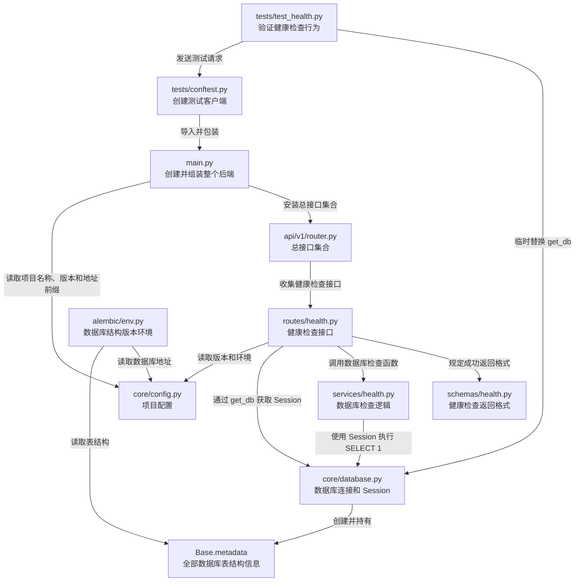
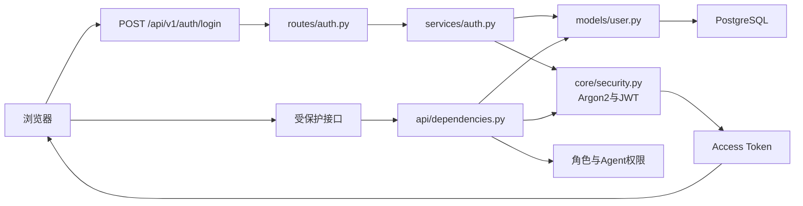
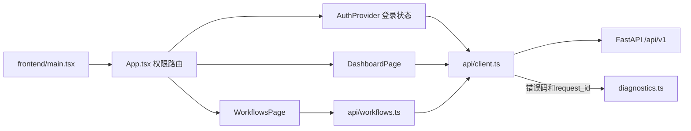
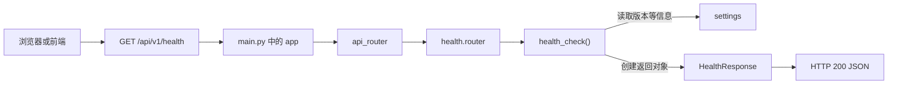
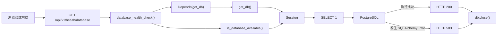
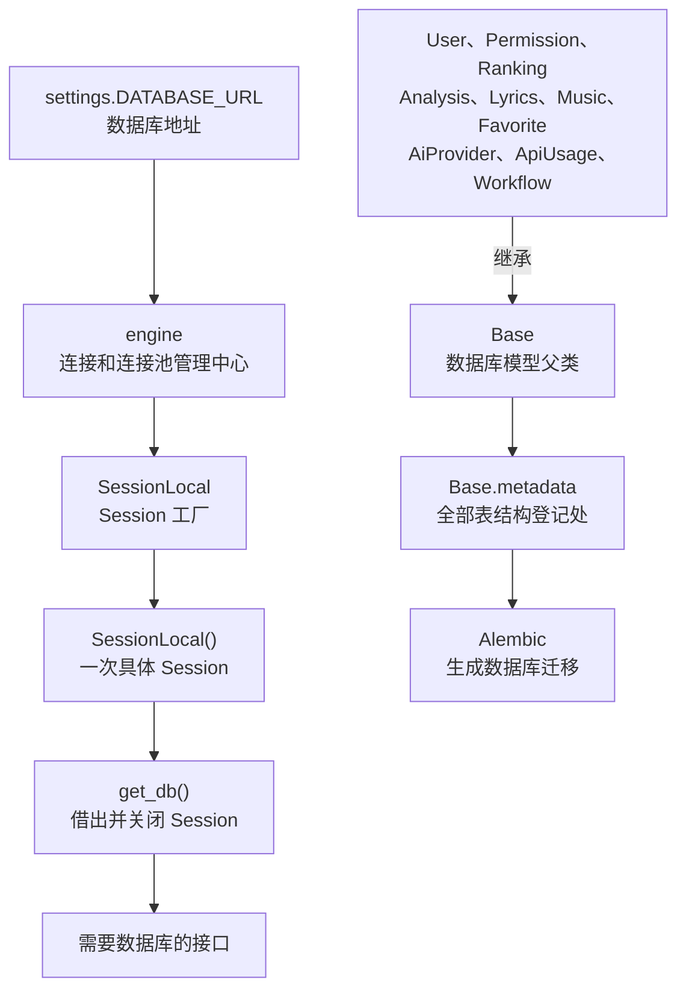
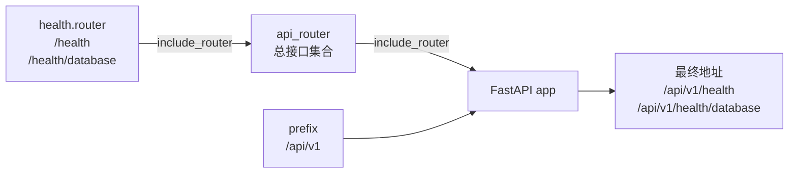
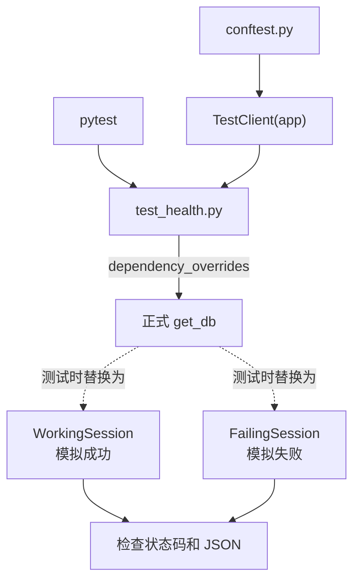
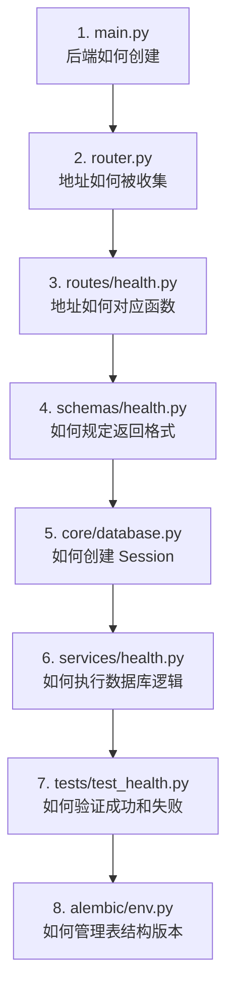
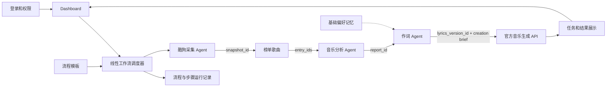

# 蓝乐项目知识图谱

这份文档通过文件之间的引用关系，展示项目代码如何连接和运行。

> 当前阶段、运行配置、产品约束和故障记忆以 `D:\SunJX\docs\notes\蓝乐_当前上下文速记.md` 为入口。本文件重点保存代码关系；健康检查部分保留为 P1 基础链路示例。

图中约定：

- 实线：当前已经存在并运行的关系。
- 虚线：后续计划实现的模块。
- 箭头：前面的文件使用、调用或依赖后面的文件。

## 1. 当前文件引用图



## 2. 登录和权限请求路线



管理员账号管理路线：

```text
routes/users.py
-> require_super_admin
-> services/users.py
-> User / UserAgentPermission
-> PostgreSQL
-> blue_music.audit 审计日志
```

前端工作台路线：



## 3. 健康检查请求路线

### 普通健康检查



### 数据库健康检查



## 4. 数据库对象关系



## 5. 接口地址组合图



## 6. 测试关系图



## 6. 推荐学习路线



## 7. 当前业务主线与未来扩展

P4 至 P7 集成基础已实现；Suno 的真实外部调用等待官方文档和密钥：



自动流程代码路线：

```text
frontend/pages/WorkflowsPage.tsx
-> frontend/api/workflows.ts
-> routes/workflows.py
-> services/workflows.py
-> services/rankings.py / analysis.py / lyrics.py
-> workflow_templates / workflow_runs / workflow_run_steps
```

## 8. 如何使用这份图谱

看到一个陌生文件时：

1. 先在“当前文件引用图”中找到它。
2. 查看谁指向它，理解谁会使用它。
3. 查看它指向谁，理解它依赖什么。
4. 再打开源代码逐行阅读。
5. 阅读相应测试，确认代码承诺的行为。

后续每增加登录、用户、榜单、分析、作词或创作模块，都要同时更新这份知识图谱。
